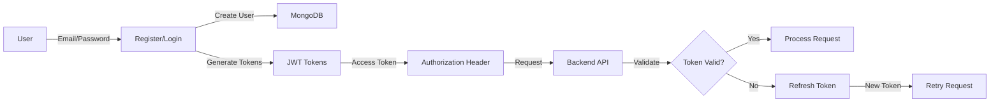
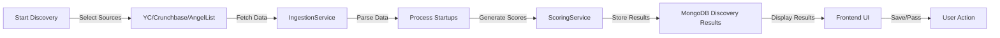

# 🎯 DealFlow - Complete Setup & Deployment Guide

## 📋 What's Been Implemented

### ✅ Phase 1: Backend Infrastructure
- FastAPI application with async/await
- MongoDB with Beanie ODM
- JWT authentication (access + refresh tokens)
- CORS enabled for frontend
- Error handling and logging

### ✅ Phase 2: Authentication System
- User registration with password hashing
- JWT token-based login
- Token refresh mechanism
- User profile management
- Fund thesis personalization

### ✅ Phase 3: Data Models
- **Startup**: Core startup data with scoring
- **User**: User profiles with thesis
- **Deal**: Deal pipeline management
- **Pipeline**: Deal stages and progression
- **Outreach**: Outreach communication tracking
- **Discovery**: AI discovery results and job tracking

### ✅ Phase 4: API Endpoints
```
Auth Endpoints:
POST   /api/v1/auth/register          - Register new user
POST   /api/v1/auth/login             - Login & get tokens
POST   /api/v1/auth/refresh           - Refresh access token
GET    /api/v1/auth/me                - Get current user
PUT    /api/v1/auth/thesis            - Update fund thesis

Startup Endpoints:
GET    /api/v1/startups               - List startups
GET    /api/v1/startups/{id}          - Get startup details
POST   /api/v1/startups               - Create startup
PUT    /api/v1/startups/{id}          - Update startup
GET    /api/v1/startups/stats         - Get statistics

Discovery Endpoints:
POST   /api/v1/discovery/run          - Start discovery job
GET    /api/v1/discovery/jobs/{id}    - Get job status
GET    /api/v1/discovery/jobs/{id}/results - Get results
POST   /api/v1/discovery/results/{id}/save - Save result
GET    /api/v1/discovery/saved        - Get saved results

Deal Endpoints:
POST   /api/v1/deals                  - Create deal
PUT    /api/v1/deals/{id}             - Update deal
GET    /api/v1/deals                  - List deals
DELETE /api/v1/deals/{id}             - Delete deal

Outreach Endpoints:
POST   /api/v1/outreach/generate      - Generate outreach
POST   /api/v1/outreach               - Create outreach
GET    /api/v1/outreach               - List outreach
PUT    /api/v1/outreach/{id}          - Update outreach
```

### ✅ Phase 5: AI Discovery Pipeline
- Data ingestion from multiple sources:
  - Y Combinator (public API)
  - Crunchbase (API with credentials)
  - AngelList (Wellfound)
- Background job processing
- MongoDB persistence
- Real-time progress tracking
- AI scoring and insights generation

### ✅ Phase 6: Frontend Components
- **Login/Register**: Authentication UI with timeout handling
- **AI Discovery Feed**: Real-time discovery results with save/pass
- **Dashboard**: Overview of deals and statistics
- **Deal Tracker**: Pipeline visualization
- **Outreach Center**: Communication tracking

### ✅ Phase 7: Fixes Applied Today
- Fixed discovery.py syntax errors
- Added timeouts to auth requests (prevents infinite loading)
- Added Discovery models to database initialization
- Improved error handling with user-friendly messages
- Export API_BASE_URL for reusability

---

## 🚀 How to Run

### Prerequisites
- Python 3.10+
- Node.js 18+
- MongoDB (local or Atlas)
- pip packages from requirements.txt
- npm packages from package.json

### Quick Start (3 Steps)

**Terminal 1 - Backend:**
```powershell
cd "C:\Users\moham\Downloads\Deal Flow\backend"
python -m uvicorn main:app --reload --host 0.0.0.0 --port 8000
```

**Terminal 2 - Frontend:**
```powershell
cd "C:\Users\moham\Downloads\Deal Flow\frontend"
npm run dev
```

**Terminal 3 (Optional) - MongoDB:**
```powershell
mongosh
```

Then open:
- Frontend: http://localhost:5173
- Backend API: http://localhost:8000
- API Docs: http://localhost:8000/docs

---

## 🔐 Authentication Flow



---

## 🔍 Discovery Pipeline Flow



---

## 📊 Database Schema

### Collections in MongoDB

```
dealflow/
├── user (authenticated users)
├── startup (startup records with scoring)
├── deal (deal pipeline entries)
├── pipeline (pipeline stage definitions)
├── outreach (outreach communications)
├── discovery_job (discovery run tracking)
└── discovery_result (discovered startup results)
```

---

## 🧪 Testing

### Test Auth
```bash
python test_auth.py
```

### Test API with curl
```bash
# Register
curl -X POST http://localhost:8000/api/v1/auth/register \
  -H "Content-Type: application/json" \
  -d '{"email":"test@example.com","password":"pass123","full_name":"Test User","company":"Fund","role":"investor"}'

# Login
curl -X POST http://localhost:8000/api/v1/auth/login \
  -H "Content-Type: application/json" \
  -d '{"email":"test@example.com","password":"pass123"}'
```

### Test Discovery
```bash
# Start discovery
curl -X POST http://localhost:8000/api/v1/discovery/run \
  -H "Authorization: Bearer YOUR_TOKEN" \
  -H "Content-Type: application/json" \
  -d '{"sources":["yc"],"limit_per_source":20}'
```

---

## 📁 Project Structure

```
Deal Flow/
├── backend/
│   ├── app/
│   │   ├── api/
│   │   │   ├── routes/
│   │   │   │   ├── auth.py
│   │   │   │   ├── discovery.py
│   │   │   │   ├── deals.py
│   │   │   │   ├── startups.py
│   │   │   │   └── outreach.py
│   │   │   └── deps.py
│   │   ├── core/
│   │   │   ├── config.py
│   │   │   ├── database.py
│   │   │   └── security.py
│   │   ├── models/
│   │   │   ├── user.py
│   │   │   ├── startup.py
│   │   │   ├── deal.py
│   │   │   ├── pipeline.py
│   │   │   ├── outreach.py
│   │   │   └── discovery.py
│   │   └── services/
│   │       ├── ingestion.py
│   │       ├── scoring.py
│   │       └── outreach.py
│   ├── main.py
│   └── requirements.txt
│
├── frontend/
│   ├── src/
│   │   ├── components/
│   │   │   ├── LoginPage.jsx
│   │   │   ├── AIDiscoveryFeed.jsx
│   │   │   ├── Dashboard.jsx
│   │   │   ├── DealTracker.jsx
│   │   │   └── ...
│   │   ├── lib/
│   │   │   ├── api.js
│   │   │   └── AuthContext.jsx
│   │   ├── services/
│   │   │   └── discoveryService.js
│   │   └── App.jsx
│   ├── package.json
│   └── vite.config.ts
│
└── Documentation/
    ├── README.md
    ├── AUTH_TROUBLESHOOTING.md
    ├── API_DOCUMENTATION.md
    └── SETUP_GUIDE.md
```

---

## 🎨 Features by Component

### Login/Register Page
- Email/password authentication
- Form validation
- Error messages with timeouts
- Fallback to localStorage (demo mode)
- Social login placeholders

### AI Discovery Feed
- Select multiple data sources
- Real-time progress indicator
- Results display with:
  - Startup name & description
  - Sector and stage
  - Discovery score (0-100%)
  - Fit score for your thesis
  - Links to company website
  - Source badges (YC, Crunchbase, etc.)
- Save/Pass actions
- Saved results management

### Dashboard
- KPI cards (total startups, deals, etc.)
- Recent activity
- Deal pipeline overview
- Discovery status

### Deal Tracker
- Pipeline stages (Prospect, Talking, Diligence, etc.)
- Drag-and-drop deal movement
- Deal details and notes
- Activity timeline

---

## 🔧 Environment Configuration

Create `.env` file in backend:
```env
# MongoDB
MONGODB_USER=dealflow_admin
MONGODB_PASSWORD=dealflow_secure_password_2025
MONGODB_HOST=localhost
MONGODB_PORT=27017
DATABASE_NAME=dealflow

# JWT
JWT_SECRET_KEY=your-secret-key-change-in-production
JWT_ALGORITHM=HS256
ACCESS_TOKEN_EXPIRE_MINUTES=30
REFRESH_TOKEN_EXPIRE_DAYS=7

# APIs
CRUNCHBASE_API_KEY=your_key_here
PROXYCURL_API_KEY=your_key_here
OPENAI_API_KEY=your_key_here

# CORS
CORS_ORIGINS=["http://localhost:5173","http://localhost:3000"]

# App
APP_NAME=DealFlow
DEBUG=True
API_V1_PREFIX=/api/v1
```

For frontend, `.env.local`:
```env
VITE_API_URL=http://localhost:8000/api/v1
```

---

## 🚀 Deployment Checklist

- [ ] Update JWT_SECRET_KEY in production
- [ ] Enable MongoDB authentication
- [ ] Set DEBUG=False in production
- [ ] Update CORS_ORIGINS with actual domain
- [ ] Add API keys for external services
- [ ] Set up HTTPS/SSL
- [ ] Configure database backups
- [ ] Set up monitoring and logging
- [ ] Create admin user
- [ ] Test all endpoints
- [ ] Set rate limiting appropriately

---

## 📞 Troubleshooting

See `AUTH_TROUBLESHOOTING.md` for detailed debugging guides.

**Quick Fixes:**
- **Loading infinitely**: Refresh page, timeout now added
- **Backend not starting**: Check MongoDB is running
- **CORS errors**: Verify frontend URL in CORS_ORIGINS
- **Auth failing**: Check MongoDB connection and user credentials

---

## 📈 Next Steps

1. **Test the full auth flow** - Login should work instantly now
2. **Try the AI Discovery** - Select YC and run discovery
3. **Create sample deals** - Use Dashboard to create deals
4. **Send outreach** - Use OutreachCenter for communications
5. **Deploy to production** - Follow deployment checklist

---

## 🎉 Completed

✅ Full-stack application
✅ Authentication system
✅ AI discovery pipeline
✅ Database persistence
✅ Error handling & timeouts
✅ Real-time progress tracking
✅ Professional UI components

---

**Version**: 2.0
**Last Updated**: December 2, 2025
**Status**: ✅ Ready for Testing

Start the backend and frontend, then try logging in!
